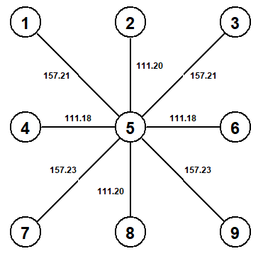
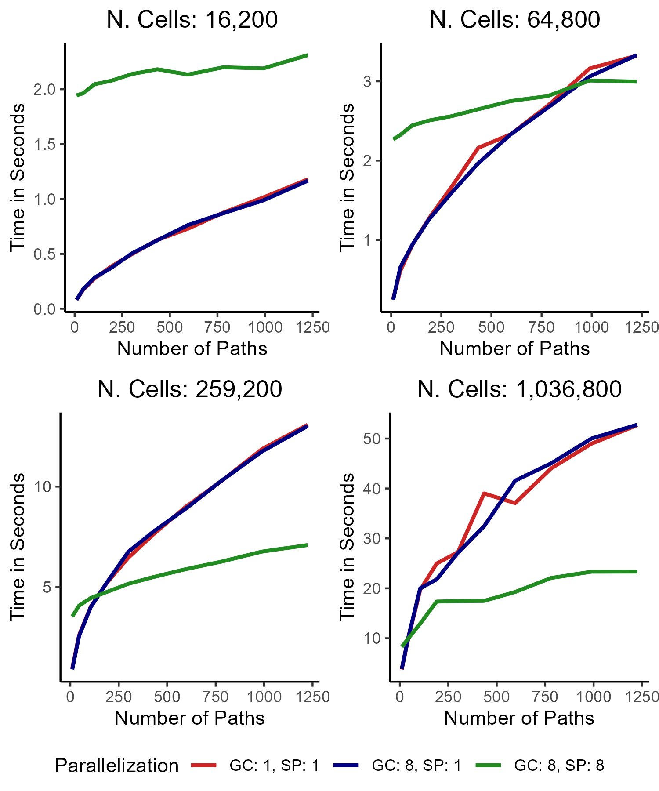

```{r, include = FALSE}
knitr::opts_chunk$set(
  collapse = TRUE,
  comment = "#>"
)
```

# Introduction
<p style="text-align: justify">What is the shortest path from Mombasa, Kenya to Marseille, France by boat? It is not the straight line between those locations, as it cuts through land. This package derives shortest paths between places taking barriers or cost surfaces into account. In the mentioned example, this would be delineating a path along the East African coast, through the Red Sea, the Suez Canal, and the Mediterranean. Apart from relating locations on Earth, `spaths` can also compute shortest paths more generally on spheres and planes.</p>

<p style="text-align: justify">Shortest paths algorithms have been around for a while and belong to the field of graph theory. Graphs, or networks, stretch well beyond geographic settings and e.g. include social networks. A leading implementation of graph theoretical methods is `igraph`, a C library. The `igraph` R package is a wrapper to that library. R packages that compute shortest paths in geographic space, most notably the `gdistance` package, convert GIS data to an `igraph` graph and apply functions available in the `igraph` R package. In the above mentioned example, we would employ Dijkstra's [-@Dijkstra1959] algorithm, identifying the shortest path in an undirected graph. In this field, undirected means that distances, or travel costs, between locations are the same in both directions. Marseille is as far from Mombasa as Mombasa is from Marseille. It is, of course, possible to abstract from the symmetry assumption and make it a directed graph, e.g. by accounting for the wind direction effect on travel speeds of a sail boat. The below section on graphs outlines such options in more detail.</p>

<p style="text-align: justify">As mentioned above, this package is not the first one to compute shortest paths in GIS data. `gdistance`, `movecost`, and `leastcostpath` are other packages targeting such functionality. The latter two are primarily `gdistance` extensions. I.e. they provide interesting applications calling `gdistance` functions. Both of them e.g. add transition functions. You can derive shortest paths based on Tobler's hiking function without having to check the equation's mathematical definition or how to pass it to `gdistance`. Thus, irrespective of which of the three packages you employ, the internal computations rely on `gdistance`.</p>

<p style="text-align: justify">`spaths` is the result of a research paper that required shortest paths computations which `gdistance` was not well suited to handle. The intention behind developing it is by no means to discredit `gdistance` in any way. `gdistance` is a useful package that has provided the R user community with spatial functionalities for more than a decade. Yet, it is not compatible with the now dominant spatial packages, `sf` and `terra`, as it appears to not have been actively developed in years. And similar to many older spatial R packages, it is not designed with computational performance as a primary target. `spaths` is not meant to replace `gdistance`. It is a different implementation of shortest paths functionalities. In that, it does not recycle any of `gdistance`'s or its dependencies' code. `spaths` is an `igraph` wrapper written from scratch.</p>

<p style="text-align: justify">`spaths` is intended to be computationally efficient and user-friendly. It targets the former objective by using `terra` as its default spatial library, by relying in large part on packages like `data.table` geared towards efficiency with C/C++ functions, by specifying its own C++ functions, and by parallelizing across CPU cores. Apart from computational efficiency being a user-friendly aspect, user-friendliness also entails flexibility regarding input data classes and the absence of the need for the user to understand how the functions operate internally. The user does not have to construct transition matrices before calling a shortest paths function. The functions construct intermediate objects automatically.</p>
<br>

# Graphs
<p style="text-align: justify">As mentioned above, this package converts the spatial data into a graph and then applies Dijkstra's algorithm from the field of graph theory to it to find the shortest paths between locations. A graph consists of vertices, also called nodes, that are connected via edges. In `spaths`, grid cell centroids are vertices linked to neighboring cells' centroids through egdes. Which neighbors are connected depends on the `contiguity` argument. Figure 1 illustrates the parameter's two options: rook's case contiguity and queen's case contiguity. In the former model, a cell is directly connected to its four horizontally and vertically adjacent neighbors. With the latter structure, a cell is also directly linked to the four diagonally adjacent neighbors, implying a total of eight direct neighbors.</p>
<br>

```{r, out.width = "46%", out.height = "30%", fig.show = "hold", fig.align = "center", fig.cap = "Figure 1: Contiguity", echo = FALSE}
knitr::include_graphics("Figure_1a.png")
knitr::include_graphics("Figure_1b.png")

```
<br>

<p style="text-align: justify">`spaths` uses queen's case contiguity by default as it often produces more appropriate shortest paths than rook's case contiguity does. The advantages of rook's case contiguity are that the fewer edges imply lower RAM requirements and shorter computational times of shortest path algorithms than with queen's case contiguity.</p>
<br>

```{r, out.width = "46%", fig.show = "hold", fig.align = "center", fig.cap = "Figure 2: Edge Weights", echo = FALSE}


```
<br>

<p style="text-align: justify">What Dijkstra's algorithm minimizes is the sum of edge weights along the path. By default, the edge weight is the distance between the centroids of the respective cells. Figure 2 illustrates edge weights as distance in kilometers between a cell at 1°N 1°E an its neighboring cells under queen's case contiguity in a lonlat grid of a one degree resolution. You can alter these edge weights by passing a transition function to `tr_fun`. Assuming that you want to account for elevation and that there is a mountain at cell five, the shortest path from cell seven to cell three might not be through five. It might be through the neighboring pixels. The transition function does not have to measure the cost of traveling between adjacent cells in meters or kilometers. It can use any unit, e.g. travel time, calories burnt etc. The shortest, or least cost, path minimizes the edge weights along it - irrespective of what units they are measured in.</p>

<p style="text-align: justify">You can pass a function to `tr_fun` that produces asymmetric transition costs. I.e. traveling from cell A to neighboring pixel B can incur different cost than traveling from B to A. Ascending a mountain may take longer than descending. Sailing against the wind might result in lower speeds than sailing with it. A graph with direction-specific edges is a directed graph. When you pass a function to `tr_fun`, the package constructs a directed graph by default. A directed graph has twice as many edges as its undirected counterpart. It therefore occupies more RAM and induces longer computational times in shortest path algorithms. If your `tr_fun` produces symmetric transition costs, set `tr_directed` to `FALSE`.</p>

<p style="text-align: justify">`tr_fun` transition functions may include the parameters `d` (distance between the pixel centroids), `x1` (x coordinate or longitude of the first cell), `x2` (x coordinate or longitude of the second cell), `y1` (y coordinate or latitude of the first cell), `y2` (y coordinate or latitude of the second cell), `v1` (`rst` layers' values from the first cell), `v2` (`rst` layers' values from the second cell), `nc` (number of CPU cores set by `ncores`), and `cl` (cluster object returned by `parallel::makePSOCKcluster(ncores)` or `parallel::makeForkCluster(ncores)`). If `rst` has one layer, the values are passed to `v1` and `v2` as vectors, otherwise they are passed as a data table. The function has to be callable from R, but does not have to be written in R. It can e.g. be a C++ function implemented via the `Rcpp` package.</p>

<p style="text-align: justify">The following function computes the travel time between pixel centroids in minutes according to the @Tobler1993 hiking function.</p>

```{r, eval = FALSE}
function(v1, v2, d) {
  return(0.01 * exp(3.5 * abs((v1 - v2) / d + 0.05)) * d)
}

```

<p style="text-align: justify">It is recommended to use vectorized R functions like the one above. It computes all edge weights without explicitly calling an iterative structure like `for`, `*apply`, or `foreach` loops. R loops are slow. If your function requires a loop, write it in C++.</p>

<p style="text-align: justify">When working with an `rst` containing multiple layers, `v1` and `v2` are data tables in which the first column refers to the first layer, the second column to the second layer etc. Set `v_matrix` to `TRUE`, if you prefer `v1` and `v2` to be converted to matrices before they are passed to the function. This can e.g. be useful when employing C++ Armadillo classes. The following example function imports `v1` and `v2` as `arma::mat` matrices. The `...` are a placeholder for the omitted function body.</p>

```{r, eval = FALSE}
Rcpp::sourceCpp(code = '
  #include <RcppArmadillo.h>
  // [[Rcpp::depends(RcppArmadillo)]]
  // [[Rcpp::plugins(cpp11)]]
  
  // [[Rcpp::export]]
  Rcpp::NumericVector example_tr_fun(arma::mat &v1, arma::mat &v2, Rcpp::NumericVector &d) {
    ...
  }
')
```

<p style="text-align: justify">The `nc` parameter is meant to parallelize C++, not R, functions. When `ncores > 1`, a parallel R backend pointed to by `cl` is already registered before `tr_fun` is called.</p>

```{r, eval = FALSE}
function(v1, v2, d, cl) {
  edge_weights <- function(x) {
    ...
  }
  edge_weights <- parallel::parLapply(cl, 1:length(d), edge_weights)
  return(edge_weights)
}

```

<p style="text-align: justify">You can make use of `foreach` loops by registering the `parallel` backend with `foreach` before the calling the loop: `doParallel::registerDoParallel(cl)`.</p>

<p style="text-align: justify">On Windows and Linux machines, OpenMP is a popular library for parallelizing C++ code. The following function extends the above mentioned example with a parallelized loop.</p>

```{r, eval = FALSE}
Rcpp::sourceCpp(code = '
  #include <RcppArmadillo.h>
  // [[Rcpp::depends(RcppArmadillo)]]
  // [[Rcpp::plugins(cpp11)]]
  #include <omp.h>
  // [[Rcpp::plugins(openmp)]]
  
  // [[Rcpp::export]]
  Rcpp::NumericVector example_tr_fun(arma::mat &v1, arma::mat &v2, Rcpp::NumericVector &d, unsigned short int nc) {
    size_t n = d.length();
    
    #pragma omp parallel for num_threads(nc)
    for(size_t x = 0; x < n; x++) {
      ...
    }
    ...
  }
')
```

<p style="text-align: justify">`spaths` also uses OpenMP in its non-`terra` distance computations. Because OpenMP is commonly not available on MacOS by default, the edge weight computations - like functions in a number of other R packages - tend to be faster on Windows and Linux than on MacOS.</p>
<br>

# Distances
<p style="text-align: justify">In a global grid, where cells are connected across the international date line and the poles, an undirected graph has `ncell * 4` or `nrow * ncol * 4` edges with queen's case contiguity. In a regional grid where cells are not connected across the borders, there are `2 - 3 * (nrow + ncol) + 4 * nrow * ncol` edges. Yet, because of the grid structure, many edges share the same distance values. Assuming Earth to be a perfect sphere, a global lonlat grid has `1 + 2 * nrow` unique edge weights, a regional one has `2 * nrow` unique weights. Accordingly, a regional raster with 1000 rows and 2000 columns produces an undirected graph with 7,991,002 edges and 2,000 unique distances or edge weights. Instead of calling the distance function 7,991,002 times on supposedly independent cell pairs, we call an optimized version of it to construct the 2,000 values and plug them into the weight attribute of 7,991,002 edges.</p>

<p style="text-align: justify">In working with lonlat data, using spherical geometry which assumes the planet to be a perfect sphere is a common choice in GIS software. The `s2` library, which the `sf` package utilizes by default, employs that framework. `spaths` is no exception to this pattern. If you prefer to use the `terra::distance` approach accounting for the different shape instead, set `dist_comp` to `"terra"`.</p>

<p style="text-align: justify">Projecting data from a spheroid to a two-dimensional plane, necessarily introduces distortions. The above mentioned bias from assuming the Earth to be a perfect sphere is small compared to the biases that can arise from distance computations on projected, i.e. non-lonlat, data. Use lonlat geometry unless you are certain that the respective projection appropriately presents distances in the region. Another caveat of working with projected data is that spatial packages usually do not compute distances across the borders of the grid. The algorithm does e.g. not compute a path the leaves the grid on the right side and re-enters it on the left side. Lonlat locations modelled on a sphere are not affected by this phenomenon. If you are working with projected data for which Euclidean distances might not be appropriate, use `terra::distance`-based distances by setting `dist_comp` to `"terra"`. The `terra` package might include further methods applicable to such cases.</p>

<p style="text-align: justify">Deriving distances with `"terra"` takes longer than it does with `"spaths"` at least in part because the former applies the distance function to all neighboring cell pairs while the latter takes the above described shortcut. So, the recommendation is to keep the default `dist_comp` argument `"spaths"`, if you favor speed over the `"terra"`'s mentioned characteristics.</p>
<br>

# Shortest Paths between Non-Earth Locations
<p style="text-align: justify">`spaths_general` computes shortest paths in general on a sphere or on a plane. It can e.g. be used to derive shortest paths on other planets or the distance between the coffee mug and the laptop on your desk. Because of its abstract applicability, some of the function's parameters differ from those of `spaths_earth`. (i) The `rst` argument is a matrix or list of matrices. These matrices are the grids that `terra` or `raster` objects represent, without additional attributes like the CRS directly attached to the object. As in `spaths_earth`, non-NA cells mark locations through which the paths may pass. If `rst` is a list, the elements are interpreted as layers and must equal in dimensions. Attributes that are otherwise included in the spatial object are here passed to separate parameters, incl. the resolution (`xres` and `yres`) and the extent (`xmin` and `ymin`). (ii) `origins` and `destinations` are matrices or data frames, not `terra`, `sf`, or `sp` objects. The first column states the x and the second column the y coordinates, irrespective of what the column names are. (iii) Because the data comes without a CRS attribute, you indicate with the `lonlat` argument whether the data is lonlat or planar. In the former case, the function uses Haversine distances. In the latter case, it employs Euclidean distances. These are the same functions that `spaths_earth` uses with `dist_comp` set to `"spaths"`. If `lonlat` is `TRUE`, you need to specify the radius of the sphere via the `radius` argument. (iv) The `update_rst` and related `touches` parameters are currently not implemented for `spaths_general`.</p>

<p style="text-align: justify">Other than the above listed points, you can use `spaths_general` like `spaths_earth`. `tr_fun` accepts functions with the same parameters, `round_dist` rounds distances to integers etc.</p>
<br>

# Optimization
<p style="text-align: justify">Using `verbose = TRUE`, you can track how long different stages of the `spaths_general` and `spaths_earth` take to compute. The two major stages are (i) constructing the graph from spatial data and (ii) computing shortest paths based on that graph. The functions tend to spend by far most of the time on the latter. The former step is usually much quicker, taking no more than a few seconds - even with tens of millions of edges. The following sections explain how to optimize both stages and cut computing times.</p>

## Avoiding Loops
<p style="text-align: justify">`spaths_general` and `spaths_earth` both offer options to avoid looping over these functions and consequently repeatedly constructing the graph. Though, graph construction usually takes no more than a few seconds, these seconds easily add up to minutes when iterating over the functions.</p>

<p style="text-align: justify">If you do not want to link all origins to all destinations, you can either make use of the `pairwise` argument or pass `origins` and `destinations` as lists. The following list outlines the implications of different settings. The below examples assume `output` to be `"lines"`. The only difference to the `output = "distance"` scenario is that the returned objects are `SpatVector`s in which each row is associated with a line geometry rather than data tables in which each line is associated with a distance value. The rest is the same. That includes the number of rows etc. In the subsequent paragraphs, $N_{origins}$ denotes the number of origins, $N_{destinations}$ the number of destinations, $i$ a list element, and `paths` the object to which the results of `spaths_earth` and `spaths_general` are written. Approaches one to six assume `update_rst` to be `NULL`.</p>

1. <p style="text-align: justify">`origins`: a single SpatVector (`terra`), sf (`sf`), or Spatial* (`sp`) object in `spaths_earth`, or a single matrix or data frame in `spaths_general`. `destinations`: `NULL`.<br>
_Result_: SpatVector of $\frac{N_{origins} (N_{origins} - 1)}{2}$ rows, if `tr_fun` is `NULL` or `tr_fun` is not `NULL` and `tr_directed` is `FALSE`. Each row corresponds to a unique `origins` pair. I.e. because of the symmetry in an undirected graph, it lists the path between two origins only once. If you want the paths to be listed twice - one observation with point A as origin and point B as destination, and one observation with B as origin and A as destination, append the object with switched column names: `rbind(paths, stats::setNames(paths, c("destination", "origin"))[, c("origin", "destination")])` in the `spaths_earth` case with `output = "lines"`. If `tr_fun` is not `NULL` and `tr_directed` is `TRUE`, the function always returns paths in both directions, returning a SpatVector of $N_{origins} (N_{origins} - 1)$ rows.</p>

2. <p style="text-align: justify">`origins`: a list of SpatVector (`terra`), sf (`sf`), or Spatial* (`sp`) objects in `spaths_earth`, or a list of matrices or data frames in `spaths_general`. `destinations`: `NULL`.<br>
_Result_: List of SpatVectors with $\frac{N_{origins,i} (N_{origins,i} - 1)}{2}$ rows, if `tr_fun` is `NULL` or `tr_fun` is not `NULL` and `tr_directed` is `FALSE`. If `tr_fun` is not `NULL` and `tr_directed` is `TRUE`, the generated SpatVectors have $N_{origins,i} (N_{origins,i} - 1)$ rows. Each list element adheres to the same structure as described in point 1. All origins in `origins[[1]]` are related to all other origins in `origins[[1]]`, all origins in `origins[[2]]` are related to all other origins in `origins[[2]]` etc.</p>

3. <p style="text-align: justify">`origins`: a single SpatVector (`terra`), sf (`sf`), or Spatial* (`sp`) object in `spaths_earth`, or a single matrix or data frame in `spaths_general`. `destinations`: a single SpatVector (`terra`), sf (`sf`), or Spatial* (`sp`) object in `spaths_earth`, or a single matrix or data frame in `spaths_general`.<br>
_Result_: SpatVector of $N_{origins} N_{destinations}$ rows, if `pairwise` is `FALSE`. The returned object lists the shortest paths from all origins to all destinations. If `pairwise` is `TRUE`, the resulting SpatVector has $N_{origins}$ rows and links `origins` and `destinations` in a pairwise fashion. It states the shortest path from the first origin to the first destination, from the second origin to the second destination etc.</p>

4. <p style="text-align: justify">`origins`: a list of SpatVector (`terra`), sf (`sf`), or Spatial* (`sp`) objects in `spaths_earth`, or a list of matrices or data frames in `spaths_general`. `destinations`: a single SpatVector (`terra`), sf (`sf`), or Spatial* (`sp`) object in `spaths_earth`, or a single matrix or data frame in `spaths_general`.<br>
_Result_: List of SpatVectors of $N_{origins,i}$ rows, if `pairwise` is `TRUE`. It relates the first row of the first `origins` list element to the first destination, the first row of the second `origins` list element to the first destination etc. The function throws an error, if `pairwise` is `FALSE` in this setup, as that links all origins to all destinations, like in approach three. Providing `origins` as a list is not necessary in that case.</p>

5. <p style="text-align: justify">`origins`: a single SpatVector (`terra`), sf (`sf`), or Spatial* (`sp`) object in `spaths_earth`, or a matrix or data frame in `spaths_general`. `destinations`: a list of SpatVector (`terra`), sf (`sf`), or Spatial* (`sp`) objects in `spaths_earth`, or a list of matrices or data frames in `spaths_general`.<br>
_Result_: List of SpatVectors of $N_{origins,i}$ rows, if `pairwise` is `TRUE`. It relates the first origin to the first row of the first `destinations` list element, the first origin to the first row of the second `destinations` list element etc. The function throws an error, if `pairwise` is `FALSE` in this setup, as that links all origins to all destinations, like in approach three. Providing `destinations` as a list is not necessary in that case.</p>

6. <p style="text-align: justify">`origins`: a list of SpatVector (`terra`), sf (`sf`), or Spatial* (`sp`) objects in `spaths_earth`, or a list of matrices or data frames in `spaths_general`. `destinations`: a list of SpatVector (`terra`), sf (`sf`), or Spatial* (`sp`) objects in `spaths_earth`, or a list of matrices or data frames in `spaths_general`.<br>
_Result_: List of SpatVectors of $N_{origins,i} N_{destinations,i}$ rows, if `pairwise` is `FALSE`. It links all rows of the first `origins` list element to all rows of the first `destinations` list element, all rows of the second `origins` list element to all rows of the second `destinations` list element etc. If `pairwise` is TRUE, the function throws an error, as this links each origin to one destination, like in approach three with `pairwise` set to `TRUE`. Providing `origins` and `destinations` as a lists is not necessary in that case.</p>

<p style="text-align: justify">With `update_rst`, you can update the graph without reconstructing it from scratch. In particular, it alters the set of cells that the algorithm is allowed to pass through, as indicated by `NA` values in `rst`. `spaths_earth` first estimates shortest paths based on `rst`, then removes any cells or vertices from the graph intersecting with geometries in the `update_rst` argument and estimates all paths again based on the updated graph. This is faster than setting further `rst` cells to `NA` and reconstructing the graph, as it just removes vertices from the already assembled graph. `update_rst` is currently only implemented to remove pixels, not to add any, not to update their values.</p>

<p style="text-align: justify">By default, `spaths_earth` checks which paths are affected by the `update_rst` geometries and only re-computes those connections. The other lines are copied without running Dijkstra's algorithm again. This can be much faster than re-estimating all paths, unless (quasi) all connections are affected by `update_rst`. If you know that (almost) all lines change, deactivate the copying functionality and the respective checks by setting `copy` to `FALSE`.</p>

<p style="text-align: justify">`update_rst` accepts a single SpatVector (`terra`), sf (`sf`), or Spatial* (`sp`) object, or a list of them. When using a single object, the function returns a list of length two. The first list element contains shortest paths based on `rst`, not taking `update_rst` into account. The second list element entails shortest paths based on `rst` updated by `update_rst`. When passing a list to `update_rst`, the function returns a list with one more element than `update_rst` has. The first element's paths refer to the unmodified `rst`, the second to paths given `rst` updated by the first element of `update_rst`, the third element to `rst` updated by the second element of `update_rst` etc. The updating is always relative to the unmodified `rst`, not an updated version from a prior iteration.</p>

<p style="text-align: justify">One application of the `update_rst` mechanism is computing the shortest shipping routes between ports given a moving barrier such as a hurricane or icebergs. You would start by generating a grid with all land pixels and other cells that ships are generally not allowed to pass through to `NA`. Then you would assemble a list of SpatVectors holding polygons marking the positions of the hurricane or icebergs at a certain point in time. Calling `spaths_earth` with the grid as `rst` and the list of SpatVectors as `update_rst` would produce a list of shortest paths, with each element listing the paths in a given time period given the location of the geographic barrier.</p>
<br>

## Graph Size
<p style="text-align: justify">Graph size, primarily expressed by the number of edges, has a major effect on computational time. Modifying it has the potential to speed up `spaths_earth` and `spaths_general` to a much larger degree than the parallelization options described in the next section usually do.</p>

<p style="text-align: justify">There are various ways of decreasing the graph size. On the one hand, there are methods which alter the graph size but are also likely to affect the shortest paths. They include applying rook's case instead of queen's case contiguity and using coarser `rst` resolutions. On the other hand, there are approaches that leave the paths unaffected. This foremostly entails cutting off vertices, i.e. grid cells, of which you are sure that they are not on the shortest path. When assessing the distance from Mombasa to Marseille by boat, you already know that the path will follow the East-African coast and then pass through the Red Sea, the Suez Canal, and the Mediterranean. So, the `rst` grid can e.g. omit the Pacific, Atlantic, and much of the Indian Ocean. Apart from adjusting the extent, you can remove pixels by increasing the share of `NA` cells within the grid. Draw polygons of regions that the path is not expected to touch and update the grid via `terra::mask`. The `raster` package also offers a `mask` function, though it is usually a lot slower than `terra` mask and one of the main reasons to generally use `terra` instead of `raster`. You can create polygons through various R packages or through GUI GIS software like QGIS. If you use a custom `tr_fun` transition function, check if it actually produces asymmetric transition costs. If its transition costs are symmetric, set `tr_directed` to `FALSE` which cuts the number of edges by 50 percent.</p>
<br>

## Parallelization
<p style="text-align: justify">Both of the functions' main sections, the graph construction and the shortest paths derivation, can be executed in parallel. By default, the functions parallelize both of them over all of the machine's CPU cores, as identified via `parallel::detectCores`. You can alter the number of cores with `ncores` and `paths_ncores`. If `paths_ncores` is not specified, `ncores` sets the number of cores for both stages. Thus, use `ncores = 1` to deactivate parallelization throughout the function call.</p>

<p style="text-align: justify">The edge weight computations are the part of the graph construction that is executed in parallel. By default, i.e. without passing a function to `tr_fun`, the edge weights are distances between neighboring cells. If `dist_comp = "spaths"`, the functions parallelize at the C++ level using the OpenMP library. As mentioned above, OpenMP is often not available by default on MacOS. In these cases, the C++ functions run serially, i.e. on a single core, even if `ncores > 1`. With `dist_comp = "terra"`, parallelization is handled at the R level. Because parallelization is more efficient in C++ than in R, the in serial executions notable speed advantage of `dist_comp = "spaths"` over `dist_comp = "terra"` can be further exacerbated in a parallel setup.</p>

<p style="text-align: justify">Because `spaths_earth` and `spaths_general` usually spend much of their execution time on deriving shortest paths, the parallel configuration in that second stage tends to have a more pronounced effect than parallelism in the first stage. To illustrate this and other attributes of the available multi-core strategies, we repeatedly call `spaths_earth`, deriving differently many shortest paths on differently large grids with different parallel settings. The blue and red lines in Figure 3 depict the results of `paths_ncores = 1` and `ncores = 1` respectively. While both derive shortest paths using a single core, the red approach employs one core to construct the graph whereas the blue approach utilizes eight cores for that first stage. Yet, the results are similar. With a custom `tr_fun` or `dist_comp = "terra"` the difference may be more pronounced.</p>

```{r, out.width = "75%", fig.align = "center", fig.cap = "Figure 3: Efficiency of Parallelism", echo = FALSE}


```
<br>

<p style="text-align: justify">Another fact that the plots highlight is that running the shortest path computations in parallel is not always faster than deriving them serially. The blue and red lines with a serially executed second stage start close to the origin and then increase rather steeply in the number of requested paths. The green lines correspond to a parallelization of both stages across eight cores. This is what happens on an eight core machine when neither `ncores` nor `paths_ncores` are specified. `ncores = 8` would also target this setting. The result of it is flatter lines with higher intercepts. The multi-core approach comes with a larger initial overhead than the serial counterpart, but has a smaller marginal time cost of computing paths beyond that. Shortest paths derivations are parallelized at the R level and this initial overhead is particularly a feature of PSOCK clusters as used in this simulation. PSOCK clusters copy various objects to all workers, producing the displayed overhead. Thus, calling `spaths_earth` or `spaths_general` with `paths_ncores = 1` can cut execution times when the graph is small or when requesting few paths. This matter is less of a concern with FORK clusters. They copy less data than PSOCK clusters and should outperform the serial approach more often than PSOCK clusters do. When it comes to parallelism in `spaths`, Linux is probably the best choice, given that MacOS does commonly not utilize OpenMP and that Windows restricts R level parallelism to PSOCK.</p>

<p style="text-align: justify">`par_lvl = "points"` is a sensible default as it works in all of the functions' use cases. It distributes the point pairs across threads. I.e. if there are 400 origin-destination combinations and the function is set to employ four cores, each core computes 100 of these paths. The alternative `"points_lists"` option can be useful when `origins` or `destinations` are lists and the number of list elements is not less than `ncores` or `paths_ncores`. With `"points_lists"`, all paths requested by a list element are handled by the same core. `par_lvl = "update_rst"` becomes a viable choice when `update_rst` is not `NULL` and the number of elements passed to `update_rst` is not less than `ncores - 1` or `paths_ncores - 1`. This option assigns cores to graphs. I.e. all paths based on one graph are all computed by the same core.</p>
<br>

# Contributions
<p style="text-align: justify">Contributions to this package are highly welcome. You can submit them as a pull request to the `ChristianDueben/spaths` GitHub repository or via email to the maintainer email mentioned in the `DESCRIPTION` file. You may also build a package on top of `spaths`, as `movecost` and `leastcostpath` did with `gdistance`.</p>
<br>

# References
