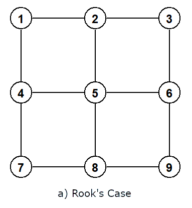
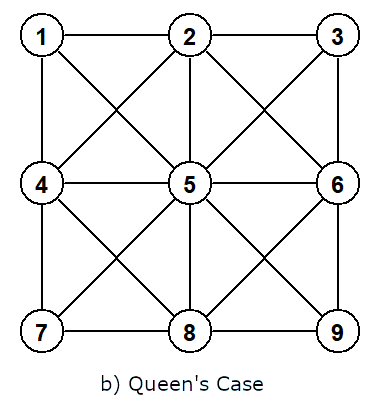

```{r, include = FALSE}
knitr::opts_chunk$set(
  collapse = TRUE,
  comment = "#>"
)
```

# Introduction
<p style="text-align: justify">Transition functions determine the cost of moving between two adjacent grid cells. They can account for the topography of the terrain, on-road versus off-road transportation, and pretty much whatever you like. They do not even have to refer to planet Earth. They can model the cost of traversing the Moon or the communication between skin cells. As long as the input is a grid, i.e. a matrix, transition functions can calculate the cost of traversing between locations.</p>

<p style="text-align: justify">In the `shortest_paths` function, you pass a custom transition function to the `tr_fun` parameter. A custom transition function overwrites the default of simply using the straight (geographic) distance between the centroids of the respective neighboring cells. `shortest_paths` deduces from your function's input parameters what data it requires. The permitted input parameter names are:</p>

- `d`: straight distance between the pixel centroids
- `x1`: x coordinate or longitude of the first cell
- `x2`: x coordinate or longitude of the second cell
- `y1`: y coordinate or latitude of the first cell
- `y2`: y coordinate or latitude of the second cell
- `v1`: `rst` layers' values from the first cell
- `v2`: `rst` layers' values from the second cell
- `nc`: number of CPU cores according to the `ncores` argument

<p style="text-align: justify">The first cell is the cell from which you move and the second cell is its neighboring cell to which you move. With a few exceptions, all of these variables use the units of the input grid `rst`. I.e. if `rst` is unprojected, e.g., using a CRS of `epsg:4326`, the coordinates in `x1`, `x2`, `y1`, and `y2` are denoted in degrees. With a Mollweide projection, the units should be meters. Use methods like `terra::crs` to find out what units your input data uses.</p>

<p style="text-align: justify">`v1` and `v2` hold the unaltered cell values. With an `rst` input grid denoting elevation, `v1` and `v2` store the elevation values of the first and second cell respectively. `nc` is the number of CPU cores that you specified when calling `shortest_paths`.</p>

<p style="text-align: justify">`d` entails the mentioned exceptions from the adherence to input units. It makes no sense to express distance in degrees. Thus, an unprojected grid produces a variable `d` measured in meter. Equivalently, the setting `dist_comp = "terra"` forces `d` to use meters. In all other cases, `d` is denoted in `rst`'s original units.</p>
<br>

# Storage Limit
<p style="text-align: justify">In the graph produced from the input grid, the connections between adjacent cells are called edges. So, when I speak of edges, think of the link between a cell and its direct neighbor. These are the connections through which the algorithm traverses the grid, from your specified origin point to the destination.</p>

<p style="text-align: justify">How many edges there are depends on the type of `contiguity` you select in `shortest_paths`. Queen's case contiguity corresponds to up to eight connections per cell (horizontal, vertical, and diagonal links), while Rook's case contiguity only corresponds to up to four connections per cell.</p>
<br>

```{r, out.width = "46%", out.height = "30%", fig.show = "hold", fig.align = "center", fig.cap = "Figure 1: Contiguity", echo = FALSE}



```
<br>

<p style="text-align: justify">It is up to and not exactly four and eight edges respectively because some cells do not have neighbors in all directions. That includes the grids outermost pixels and cells bordering `NA` neighbors. `rst` cells with a value of `NA` count as blocked. No edges connect to or from these cells, and the algorithm does, hence, not traverse them. How many pixels the outermost cells have depends on where exactly the cell is and whether the grid is global and unprojected. Following the convention of geo-spatial software, the easternmost and westernmost pixels in a unprojected grid reaching from 180 degrees West to 180 degrees East are directly connected. In any other case, the graph does not connect cells across the grid's borders, leaving the grid on one side and reentering it on another.</p>

<p style="text-align: justify">R has a size limit of `r format(.Machine$integer.max, big.mark = ",")` elements per container. Data frames, and consequently data tables, can only store `r format(.Machine$integer.max, big.mark = ",")` rows and matrices cannot exceed `r format(.Machine$integer.max, big.mark = ",")` cells. Hence, `shortest_paths` can only store up to `r format(.Machine$integer.max, big.mark = ",")` edges in R. Beyond that, it must handle this step in C++.</p>

<p style="text-align: justify">When the edge data, namely the variables passed to your transition function, are stored in R, you do not have to understand C++. You can purely write your transition function in R. And as long as your function uses vectorization instead of `for`, `while`, or `*apply` loops, R is an efficient choice. Only use a C++ function implemented via Rcpp, if you necessarily need one of these explicit loop structures - which is usually not the case in transition functions.</p>

<p style="text-align: justify">Beyond the `r format(.Machine$integer.max, big.mark = ",")` edge limit, you cannot pass an R function to `tr_fun`. You have to write it in C++ and need to understand how pointers work. Both your transition functions' inputs and outputs use different formats than in the simpler R scenario.</p>

<p style="text-align: justify">Call `spaths`'s `max_edges` function to figure out which side of the cutoff you are on. The following sections guide through both cases with examples.</p>
<br>

## Below Cutoff
<p style="text-align: justify">Let me first go through the scenario in which there are no more than `r format(.Machine$integer.max, big.mark = ",")` edges and the data can be passed in the form of R objects.</p>

<p style="text-align: justify">In that case, `d`, `x1`, `x2`, `y1`, and `y2` are always vectors with one element per edge. `v1` and `v2` are also vectors, if `rst` only has one layer. When `rst` has multiple layers, `v1` and `v2` are data tables, with one row per edge and the first column referring to the first layer, the second column to the second layer, etc. You can overwrite this behavior and turn `v1` and `v2` into matrices by setting `v_matrix` to `TRUE`, if all layers have the same data type.</p>

<p style="text-align: justify">The ordering is identical. The first element in `d` corresponds to the same edge as the first element in `x1`, `x2`, `y1`, `y2`, `v1`, and `v2`. The vector returned by your `tr_fun` transition function has to adhere to the same order.</p>

<p style="text-align: justify">The `distance_type` parameter in `shortest_paths` refers to the output of the transition function, not to the input. So, if you set `distance_type` to `int` or `unsigned short int`, your function should return an integer vector. Otherwise, it should return a numeric vector.</p>

<p style="text-align: justify">Take Tobler's [-@Tobler1993] hiking function as an example:</p>

```{r, eval = FALSE}
function(d, v1, v2) d / (6000 * exp(-3.5 * abs((v2 - v1) / d + 0.05)))
```
<br>

<p style="text-align: justify">It estimates the travel time between locations conditional on terrain topography. `rst` is a digital elevation model, i.e. a grid in which cell values denote elevation. The function expresses the transition cost in terms of the hours it takes to travel between locations. It combines the straight line distance in meters `d` with the altitude difference, i.e. the value of the second cell `v2` minus the value of the first cell `v1`.</p>

<p style="text-align: justify">The function is efficient because it is vectorized and solely requests the vectors that are actually used in the function body. Specifying `function(d, v1, v2, x1)` instead of `function(d, v1, v2)` would be inefficient, because it would have `shortest_paths` assemble the in this function unused `x1` vector.</p>

<p style="text-align: justify">As you might notice, Tobler's function produces asymmetric transition costs. Moving from the first to the second cell does not incur the same cost as moving from the second cell to the first cell. That is because walking uphill is not equally fast as walking the same slope downhill. `shortest_paths` by default assumes a custom transition function to produce asymmetric edge weights, i.e. transition costs. If your function produces symmetric weights, meaning the costs are independent of the direction in which you move, you should set `tr_directed` to `FALSE`.</p>

<p style="text-align: justify">In C++, Tobler's hiking function could look as follows:</p>

```{Rcpp, eval = FALSE}
// [[Rcpp::plugins(cpp20)]]
#include <Rcpp.h>
#include <cmath>
#include <cstddef>

// [[Rcpp::export]]
Rcpp::NumericVector tobler(Rcpp::NumericVector& d, Rcpp::NumericVector& v1, Rcpp::NumericVector& v2) {
  const std::size_t n_edges = d.size();
  Rcpp::NumericVector weights (n_edges);
  for(std::size_t i = 0; i < n_edges; ++i) {
    weights[i] = d[i] / (6000.0 * std::exp(-3.5 * std::abs((v2[i] - v1[i]) / d[i] + 0.05)));
  }
  return weights;
}
```
<br>

<p style="text-align: justify">As already mentioned, the C++ function should not perform better than the R function, as the R function is vectorized. I list it here simply to explain how to write a transition function in C++.</p>

<p style="text-align: justify">In case it is not clear to you yet how to define a transition function, let me go through a more complex example. Assume that you can travel on land and water. Tobler's hiking function determines, the travel time from a land cell to a neighboring land cell. The speed from river cell to river cell is 5 km/h, from sea to sea 12 km/h, and from land to water or vice versa 1 km/h. The input grid contains two layers, of which the first measures elevation and the second represents surface type (0: land, 1: river, 2: sea). Thus, the first column of `v1` and `v2`, therefore holds elevation and the second column the surface classification.</p>

```{r, eval = FALSE}
travel_time <- function(d, v1, v2) {
  return(
    d / (
      ((v1[[2L]] == 0L & v2[[2L]] == 0L) * 6000 * exp((-3.5) * abs((v2[[1L]] - v1[[1L]]) / d + 0.05))) + # Land to land: Tobler's hiking function
      ((v1[[2L]] == 2L & v2[[2L]] == 2L) * 12000) + # sea to sea: 12 km/h
      ((v1[[2L]] + v2[[2L]] != 4L & v1[[2L]] > 0L & v2[[2L]] > 0L) * 5000) + # river to river, river to sea, or sea to river: 5 km/h
      (((v1[[2L]] == 0L & v2[[2L]] > 0L) | (v1[[2L]] > 0L & v2[[2L]] == 0L)) * 1000) # Land to river/ sea or river/ sea to land: 1 km/h
    )
  )
}
```
<br>

<p style="text-align: justify">This transition function is vectorized as well and does not require C++ for computational performance reasons. Yet, to showcase the C++ alternative (without function body) again:</p>

```{Rcpp, eval = FALSE}
// [[Rcpp::plugins(cpp20)]]
#include <Rcpp.h>

// [[Rcpp::export]]
Rcpp::NumericVector travel_time(Rcpp::NumericVector& d, Rcpp::DataFrame& v1, Rcpp::DataFrame& v2) {
  ...
}
```
<br>

<p style="text-align: justify">In this example, the layers of `rst` are of different data types - numeric and integer. Thus `v1` and `v2` need to be data frames. If they were of the same type, you could turn `v1` and `v2` into matrices by setting `v_matrix` to `TRUE` and input them as C++ Armadillo matrices. This does not benefit performance and is just a convenience for Armadillo users.</p>

```{Rcpp, eval = FALSE}
// [[Rcpp::plugins(cpp20)]]
// [[Rcpp::depends(RcppArmadillo)]]
#include <RcppArmadillo.h>

// [[Rcpp::export]]
Rcpp::NumericVector travel_time(Rcpp::NumericVector& d, arma::mat& v1, arma::mat& v2) {
  ...
}
```
<br>

## Above Cutoff
<p style="text-align: justify">If your `rst` produces more than `r format(.Machine$integer.max, big.mark = ",")` edges, the nature of transition functions changes. You can neither use R functions nor the above mentioned kind of C++ functions. Instead, you have to utilize C++ receiving `Rcpp::XPtr` pointer objects to native C++ data structures. The data and the available variables are the same. They just come in a different format. The variables are now passed to transition functions as:</p>

- `Rcpp::XPtr<std::vector<double> > d`
- `Rcpp::XPtr<std::vector<double> > x1`
- `Rcpp::XPtr<std::vector<double> > x2`
- `Rcpp::XPtr<std::vector<double> > y1`
- `Rcpp::XPtr<std::vector<double> > y2`
- `Rcpp::List v1`
- `Rcpp::List v2`
- `int nc`

<p style="text-align: justify">`v1` and `v2` are always lists, even if the input grid has only one layer. Inside these lists are pointers to vectors. The list elements are named after the layers in `rst`. Integer layers are inserted as `Rcpp::XPtr<std::vector<int> >`, numeric layers as `Rcpp::XPtr<std::vector<double> >`, character layers as `Rcpp::XPtr<std::vector<std::string> >`, and logical layers as `Rcpp::XPtr<std::vector<bool> >`. Other layer data types are not supported.</p>

<p style="text-align: justify">Tobler's hiking function looks as follows in this framework:</p>

```{Rcpp, eval = FALSE}
// [[Rcpp::plugins(cpp20)]]
#include <Rcpp.h>
#include <cmath>
#include <cstddef>

// [[Rcpp::export]]
Rcpp::XPtr<std::vector<double> > tobler(Rcpp::XPtr<std::vector<double> > d, Rcpp::List v1, Rcpp::List v2) {
  const std::size_t n_edges = d->size();
  Rcpp::XPtr<std::vector<double> > v1_elevation = v1["elevation"];
  Rcpp::XPtr<std::vector<double> > v2_elevation = v2["elevation"];
  std::vector<double>* weights = new std::vector<double>(n_edges);
  for(std::size_t i = 0; i < n_edges; ++i) {
    (*weights)[i] = (*d)[i] / (6000.0 * std::exp(-3.5 * std::abs(((*v2_elevation)[i] - (*v1_elevation)[i]) / (*d)[i] + 0.05)));
  }
  Rcpp::XPtr<std::vector<double> > p(weights);
  return p;
}
```
<br>

<p style="text-align: justify">Because `d` is a pointer (memory address of the vector instead of the vector itself), you now access methods with `->` instead of `.`. And with `v1` and `v2` being lists, you need to tell C++ what the nature of their elements are before you use them. Interactions not based on methods appended with `->`, but through an index, have to be dereferenced with `*` and preferably parentheses to avoid operator precedence problems. Hence, `d[i]` becomes `(*d)[i]`. Before returning the data to R, remember to convert the raw pointer (here `weights`) to an `Rcpp::XPtr` (here `p`).</p>

# Performance
<p style="text-align: justify">spaths is a computational performance-focused package. Hence, I encourage users to follow that theme in custom transition functions as well. As I mentioned above, favor vectorized R functions, if possible. And only request inputs that the function actually uses. If you need an explicit loop structure (`*apply`, `for`, `while`), consider writing the function in C++.</p>

<p style="text-align: justify">If you want to speed up C++'s already fast `for` loops, you may use vectorization and parallelism in the above cutoff scenario. R's native containers, i.e. `Rcpp::IntegerVector`, `Rcpp::NumericVector`, etc., are, unfortunately not thread-safe. Hence, parallelism using OpenMP in C++ in not guaranteed to work error-free on these objects. The native C++ vectors in the above cutoff case should, in contrast, work fine.</p>

<p style="text-align: justify">The above code with a vectorization instruction:</p>

```{Rcpp, eval = FALSE}
// [[Rcpp::plugins(cpp20)]]
// [[Rcpp::plugins(openmp)]]
#include <Rcpp.h>
#include <cmath>
#include <cstddef>
#ifdef _OPENMP
#include <omp.h>
#else
#define omp_get_num_threads()  1
#define omp_get_thread_num()   0
#define omp_get_max_threads()  1
#define omp_get_thread_limit() 1
#define omp_get_num_procs()    1
#endif

// [[Rcpp::export]]
Rcpp::XPtr<std::vector<double> > tobler(Rcpp::XPtr<std::vector<double> > d, Rcpp::List v1, Rcpp::List v2) {
  const std::size_t n_edges = d->size();
  Rcpp::XPtr<std::vector<double> > v1_elevation = v1["elevation"];
  Rcpp::XPtr<std::vector<double> > v2_elevation = v2["elevation"];
  std::vector<double>* weights = new std::vector<double>(n_edges);
  #pragma omp simd
  for(std::size_t i = 0; i < n_edges; ++i) {
    (*weights)[i] = (*d)[i] / (6000.0 * std::exp(-3.5 * std::abs(((*v2_elevation)[i] - (*v1_elevation)[i]) / (*d)[i] + 0.05)));
  }
  Rcpp::XPtr<std::vector<double> > p(weights);
  return p;
}
```
<br>

<p style="text-align: justify">With parallelism:</p>

```{Rcpp, eval = FALSE}
// [[Rcpp::plugins(cpp20)]]
// [[Rcpp::plugins(openmp)]]
#include <Rcpp.h>
#include <cmath>
#include <cstddef>
#ifdef _OPENMP
#include <omp.h>
#else
#define omp_get_num_threads()  1
#define omp_get_thread_num()   0
#define omp_get_max_threads()  1
#define omp_get_thread_limit() 1
#define omp_get_num_procs()    1
#endif

// [[Rcpp::export]]
Rcpp::XPtr<std::vector<double> > tobler(Rcpp::XPtr<std::vector<double> > d, Rcpp::List v1, Rcpp::List v2, const int nc) {
  const std::size_t n_edges = d->size();
  Rcpp::XPtr<std::vector<double> > v1_elevation = v1["elevation"];
  Rcpp::XPtr<std::vector<double> > v2_elevation = v2["elevation"];
  std::vector<double>* weights = new std::vector<double>(n_edges);
  #pragma omp parallel for num_threads(nc)
  for(std::size_t i = 0; i < n_edges; ++i) {
    (*weights)[i] = (*d)[i] / (6000.0 * std::exp(-3.5 * std::abs(((*v2_elevation)[i] - (*v1_elevation)[i]) / (*d)[i] + 0.05)));
  }
  Rcpp::XPtr<std::vector<double> > p(weights);
  return p;
}
```
<br>

<p style="text-align: justify">To combine the two, simply add `simd` to the `pragma` line in the parallel example. Like the whole spaths package, this code only runs in parallel, if your compiler supports OpenMP. Parallelism is not always beneficial; but when it is, your transition function might be notably slower on some macOS machines than on Windows and Linux. Absent OpenMP support is primarily an issue of macOS systems.</p>
